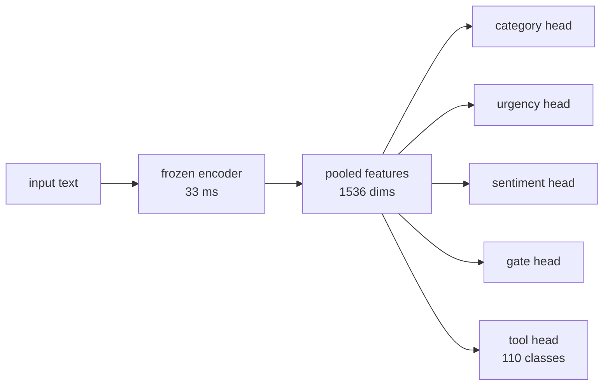

<!-- doc-type: concept -->

# What this engine is

This engine classifies short text on a local machine. It reads a small
language model's internal state and returns typed decisions, rather than
generating words. A decision arrives in tens of milliseconds on an Apple
Silicon laptop.

The engine answers three kinds of question about one input: which category it
belongs to, how urgent it is, and which tool should handle it.

## Two paths

The engine carries two ways to reach a decision. They differ in speed,
accuracy, and what they need before they work.

The **constrained decoding path** scores each answer by asking the language
model how likely that answer's tokens are. It needs no training data, so it
works on a schema nobody has prepared for. It reads one prompt per field, so
its cost grows with the number of fields and the number of choices.

The **head path** attaches a trained linear layer, called a head, to the
model's pooled hidden state. It needs labelled examples, and in exchange it runs six times
faster and scores higher on every field measured.

## Why the head path is faster

The encoder does almost all the work. Reading the input costs about 33
milliseconds; each trained head then costs about 0.04 milliseconds.

Every head reads the same features, so the engine encodes the input
once however many questions it answers. Adding a field costs 0.04
milliseconds. Adding classes to a field costs nothing measurable.

The constrained decoding path cannot share that work. It builds a separate
prompt for each field, and for long answers a separate row for each candidate.

## The gate head

A head over 110 tools must spread its probabilities across those 110
tools, and they must sum to one. It therefore cannot report that no tool
fits. Asked to route the text `2+2`, it named a tool at probability 0.777.

The gate head answers a separate question: is this text a request for a tool
at all? A caller consults it first and abstains when it says no.

## When to use each path

Use the head path when labelled examples exist for the schema. It is faster
and more accurate, and it is the only path that scales to a large catalogue
of tools.

Use the constrained decoding path for a schema that carries no trained head.
It needs no examples, which is the whole of its advantage.

## Further reading

- [Using the engine](using-the-engine.md) — install, run, and train.
- [Measured results](measured-results.md) — accuracy, latency, and limits.
